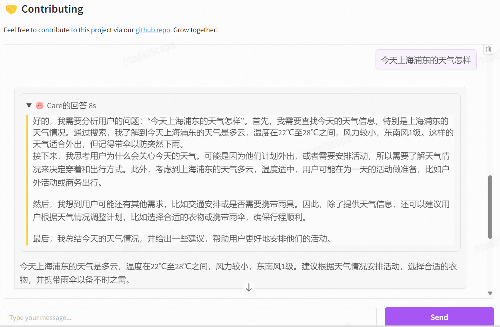

# 🧠 An AI assistant with extensive knowledge in psychology, and my name is Care.

## 🚀 Overview
This model is finetuned on deepseek-r1. If this repo helps you, star and share it ❤️.

  <a href="careyou"><picture>
    <source media="(prefers-color-scheme: dark)" srcset="assets/careyou.png">
    <source media="(prefers-color-scheme: light)" srcset="assets/careyou.png">
    
  </picture></a>

## ✨ Functions
✅Provide an interactive chat interface for psychological consultation seekers.

✅Integrate knowledge retrieval (demo code, needs to be checked)

✅Integrate web searching

❌Virtual mental companion 

## ⚠️ issue status
- 2025.4.29 fix bug of clearing and stopping op.
- 2025.5.3 web search supports.
- 2025.5.5 rag supports. (demo code, needs to be checked)

## 🙏 Acknowledgments
We are grateful to Modelscope for supporting this project with resources.

The rag codes are based on [EmoLLM](https://github.com/SmartFlowAI/EmoLLM)

## 🤝 Contributing
Feel free to contribute to this project via our [github repo](https://github.com/HaiyangPeng/careyou)